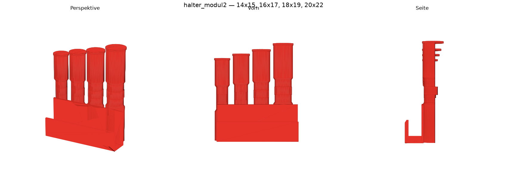

# Werkzeugwand

3D-gedruckte Werkzeughalter für eine Garagenwand — parametrisch modelliert als
Python-Code mit [build123d](https://github.com/gumyr/build123d), Export als STL,
3MF und STEP.



## Worum es geht

Die Wand besteht aus waagerechten Brettern auf senkrechten Latten, sodass **hinter
jedem Brett ein Luftspalt** bleibt. Die Halter werden deshalb nicht geschraubt: Sie
greifen über die **Oberkante** eines Bretts — ein kurzer Schenkel rutscht hinten in
den Spalt, ein Steg läuft über die Kante, die Frontplatte liegt vorne am Brett.

```
      ║ Wand
      ║   ┌─┐  ← Schenkel im Luftspalt
      ║   │ │
   ┌──╨───┘ │  ← Steg über die Brettkante
   │        │
   │ Brett  │
   │        │  ← Frontplatte, trägt die Aufnahmen
```

Damit sitzt jeder Halter fest, lässt sich aber jederzeit abheben und an eine andere
Stelle schieben. Kein Bohren, keine Schraube, keine Lochwand.

Der einzige Wert, der dafür stimmen muss, ist die lichte Weite dieses Kanals —
hier **25 mm**. Wer die Idee auf seine eigene Wand übertragen will, ändert
`KLEMMKANAL` in `kern/wandhalter.py` und ist fertig; alles andere rechnet sich daraus.

## Was drin ist

| Halter | Werkzeug |
|---|---|
| `rohrsteckschluessel` | WIESEMANN 1893 Rohrsteckschlüsselsatz 10-tlg, 6–22 mm (Art. 81420) |

Jedes Rohr steckt in einer C-Hülse, die vom Steg bis nach unten läuft und dort mit
einem Boden schließt. Das Rohr **steht** auf diesem Boden — der trägt das Gewicht.
Ein Clip auf halber Höhe sichert nur gegen Herausfallen und darf deshalb
leichtgängig sein. Entnahme: nach vorn ziehen.

Weil die Rohre zu den Enden hin angestaucht sind (damit ein Maulschlüssel greift),
ist die Hülse dreigeteilt: **weit – eng – weit**, mit 45°-Konen dazwischen.

## Bauen

```bash
python3 -m venv .venv
./.venv/bin/pip install build123d matplotlib

./.venv/bin/python bauen.py --liste                       # welche Halter gibt es
./.venv/bin/python bauen.py                               # alle bauen
./.venv/bin/python bauen.py rohrsteckschluessel --test    # nur die Testclips
```

Die Dateien landen in `halter/<name>/druck/`.

## Drucken

Prusa MK4S, **PETG** (nicht PLA — die Garage wird im Sommer warm, und PLA kriecht
unter Dauerlast).

Die Slicer-Dateien werden **bereits druckfertig gedreht** exportiert: Der Steg liegt
auf dem Bett, das Teil steht kopfüber. **Im Slicer nichts drehen.** Nur so öffnet
sich der Hakenkanal nach oben und die Hülsen wachsen als senkrechte Prismen vom Bett
hoch — das ganze Teil druckt dann **ohne eine einzige Stütze**.

- **Brim an** (die Teile sind schmal und hoch)
- **Supports AUS** — nicht „weniger", sondern aus. In dieser Lage sind sie
  überflüssig und würden in den Hülsenbohrungen und im Hakenkanal landen.

Die `.step` bleibt im Wandkoordinatensystem (z = 0 ist die Brettoberkante), damit man
in Fusion 360 & Co. an der Wand messen kann.

## Aufbau

```
kern/wandhalter.py    Klemmmechanismus + Drucker + Export.  Für alle Halter gleich.
kern/preview.py       rendert eine STL als PNG zur Sichtkontrolle
bauen.py              findet alle Halter und baut sie
halter/<name>/
    modell.py         das Teil. Messwerte stehen oben im Kopf.
    NOTIZEN.md        Messwerte, Testergebnisse, was schiefging, was offen ist
    druck/            erzeugte Dateien (nicht im Repo, bauen sich neu)
CLAUDE.md             Konstruktionsregeln, Druckregeln, build123d-Fallen
```

Ein neuer Halter ist ein Ordner mit einer `modell.py`, die `TITEL`, `AUSGABE` und
`bauen()` bereitstellt — `bauen.py` findet ihn dann von selbst.

**Wer nachbauen will, sollte die [CLAUDE.md](CLAUDE.md) lesen.** Da stehen die Regeln,
die man sonst schmerzhaft selbst lernt: warum ein frei vor der Platte schwebender
Clip sich nicht drucken lässt, warum die Wandstärke mit dem Durchmesser mitwachsen
muss, und warum ein Werkzeug nicht *einen* Durchmesser hat.

## Lizenz

MIT — siehe [LICENSE](LICENSE).
